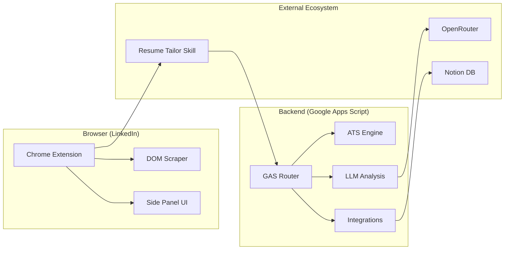

# 🔮 Upside Down - AI Resume Copilot

Built for the modern job seeker. **Upside Down** is a high-performance Chrome Extension and Google Apps Script backend that transforms LinkedIn into a powerful career-hunting command center.

---

## 🚀 Key Features

- 📊 **Deterministic ATS Engine** — Stable weighted keyword coverage with alias matching, stemming, section diagnostics, and a mini-taxonomy. No AI "guesses" in the score.
- 🤖 **Multi-LLM Analysis** — Powered by Gemini and Mistral via OpenRouter. Extracts keywords and generates deep insights in a single pass.
- 📓 **Notion Integration** — One-click export to your Job Tracking board. Automatically builds a rich Insight Card within your Notion database.
- 📝 **Agent-Skill Resume Tailoring** — A signed tailoring task keeps the resume rules, user-confirmed skills, Drive draft, ATS re-score, and Notion completion lifecycle consistent.

---

## 🏗️ Architecture

---

## 🛠️ Components

### 🖥️ Chrome Extension

Modern, non-blocking UI that slides into your job hunt.

- **Scraper**: Reliable extraction using `scraper.js`.
- **Logic**: Modularized into `main.js`, `prompt.js`, and `ui.js`.
- **Styles**: Premium visuals in `styles.js`.

### ☁️ Google Apps Script (Backend)

High-concurrency, modularized GAS environment managed via `clasp`.

- **`analysis.js`**: LLM orchestration and keyword extraction.
- **`atsEngine.js`**: The scoring brain (weighted coverage, alias matching, stemming, section diagnostics, and taxonomy).
- **`notion.js`**: Seamless connection to Notion's Block API.
- **`router.js`**: Central entry point for all endpoint requests.
- **`tailoring.js`**: Signed task preparation, draft lifecycle, completion validation, and deterministic re-scoring.

### Resume Tailoring Lifecycle

1. Analyze a job and confirm any uncertain skills in the extension.
2. Create prepares a signed task in Notion; it does not create a Drive draft.
3. Paste the compact dispatch into an agent with the `resume-tailor` skill.
4. The skill creates or reuses `Akash CVs / <Company> / <Role>_<JobId> / Akash_Raj` only when work starts.
5. The completion callback validates the document, re-scores it with the saved rubric, and updates Notion for review.

---

## ⚙️ Setup & Deployment

1.  **Backend**: Navigate to `google-apps-script/` and run `clasp push`.
2.  **Config**: Set your `OPENROUTER_API_KEY` and `NOTION_TOKEN` in GAS Script Properties.
3.  **Extension**: Load the `extension/` folder as an unpacked extension in Developer Mode.

> 💡 **Pro-Tip**: Use the `deploy-gas` skill for one-click updates to the backend.

---

## 📜 License

Distributed under the MIT License. See `LICENSE` for more information.

---

_“Turning the job hunt right-side up.”_
