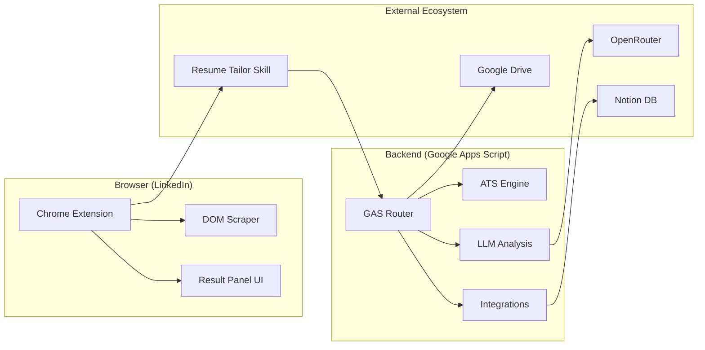

# 🔮 Upside Down — AI Resume Copilot

**Upside Down** turns LinkedIn into a job-hunting command center. A Chrome extension scrapes the job you're looking at, a Google Apps Script backend scores your resume against it with a deterministic ATS engine, and an agent skill tailors your Summary and Skills through a signed, bounded patch lifecycle — writing the result straight into Google Drive and your Notion tracker.


---

## 🚀 Key Features

- 📊 **Deterministic ATS Engine** — Stable weighted keyword coverage with alias matching, stemming, section diagnostics, and a mini-taxonomy. No AI "guesses" in the score.
- 🤖 **LLM Analysis** — A single OpenRouter call extracts the job rubric, keywords, and insights. Provider is swappable (OpenAI / Gemini / NVIDIA) via config or a Script Property.
- 🔒 **Rubric Stability** — The rubric generated on first analysis is persisted and reused, so re-scoring a job after tailoring is an apples-to-apples comparison, not a fresh LLM opinion.
- 📓 **Notion Integration** — One-click export to a Jobs board. The database schema is auto-provisioned on first save; workflow metadata lives in a collapsed toggle inside the page, not as columns.
- 📝 **Agent-Skill Resume Tailoring** — A signed task keeps the resume rules, user-confirmed skills, Drive folder, ATS re-score, and Notion lifecycle consistent. The agent never touches a Google Doc directly.

---

## 🏗️ Architecture



Everything server-side runs in one Apps Script web app. `doPost` handles each request; the request `action` selects the operation:

| Action | Caller | What it does |
| --- | --- | --- |
| `analyze` | Extension | Builds the ATS rubric, scores the resume, and returns the analysis. |
| `save` | Extension | Persists a tailoring task to Notion and returns `{ jobId, agentEndpoint }`. Creates **no** Drive file. |
| `claimTailoringTask` | Agent skill | Validates the token, marks the task claimed, and returns the analysis brief plus current Summary/Skills from the base resume. |
| `applyTailoringPatch` | Agent skill | Copies the base resume into the job folder, applies and verifies the patch, re-scores it, and updates Notion. |
| `saveRecruiterEmails` | Recruiter enrichment | Idempotently persists verified recruiter contacts for one Job ID and verifies the Notion read-back. |

---

## 🛠️ Components

### 🖥️ Chrome Extension (`extension/`)

Manifest V3, injected on `https://www.linkedin.com/jobs/*`.

- **`scripts/scraper.js`** — Pulls role, company, description, and job ID out of the current job-details DOM.
- **`scripts/main.js`** — Click handler and orchestration; drives the analyze → confirm → save flow.
- **`scripts/ui.js`** — Floating action button, result panel, and the keyword-confirmation checkboxes.
- **`scripts/main.js`** — Starts the native Codex handoff after saving the tailoring task.
- **`scripts/styles.js`** — Inline style constants.
- **`background.js`** — Service worker; the fetch "tunnel" that bypasses LinkedIn's CSP. Reads `GAS_URL` from `config.js`.

### ☁️ Google Apps Script (`google-apps-script/`)

Modular V8 runtime project managed with `clasp`.

- **`router.js`** — Web-app entry points, action dispatch, and the analysis operation.
- **`analysis.js`** — Provider selection, rubric extraction, and LLM orchestration.
- **`atsEngine.js`** — The scoring brain: weighted coverage, alias matching, stemming, section diagnostics, taxonomy.
- **`resume.js`** — Base-resume reads, Drive folder/copy operations, and the bounded Summary/Skills document edits.
- **`tailoring.js`** — HMAC-signed task tokens, claim/apply lifecycle, patch validation, and deterministic re-scoring.
- **`notion.js`** — Tracker schema provisioning, page reads/writes, and the system-state toggle block.
- **`integrations.js`** — Optional Google Sheets logging and GitHub Gist export.
- **`config.js`** — Non-secret constants (models, endpoints, temperature). Secrets live in Script Properties.

### 🧩 Agent Skill (`.agents/skills/resume-tailor/`)

- **`SKILL.md`** — The tailoring contract the agent follows.
- **`scripts/task-client.js`** — `claim` and `apply` CLI wrappers around the web-app endpoint.
- **`scripts/resume_builder.js`** — A local formatting utility for deliberate **base resume** maintenance. It is not part of the tailoring runtime.

---

## 🔄 Resume Tailoring Lifecycle

1. Analyze a job from the extension and confirm any uncertain skills in the result panel.
2. **Create tailoring prompt** prepares a signed task in Notion. It does *not* create a Drive document.
3. The extension copies a compact dispatch prompt to your clipboard. Paste it into an agent that has the `resume-tailor` skill.
4. The skill claims the task and returns only a `summary` / `skills` patch. Its editable baseline is read from the canonical Base Resume Google Doc at claim time.
5. The backend copies that Base Resume into `Akash CVs / <Company> / <Role>_<JobId> / Akash_Raj`, applies and verifies the bounded patch, re-scores it with the saved rubric, and updates Notion for review.

Design rules this enforces:

- `RESUME_DOC_ID` is the only resume source of truth. The skill never stores or renders a second copy of the resume data.
- A patch may contain **only** `summary` and `skills`. Anything else is rejected.
- The patch must return the *complete* final Skills section with **exactly the same number of rows** as the base resume — additions get consolidated into existing rows, never appended as new ones.
- Task tokens are HMAC-SHA256 signed and expire after 4 hours.

### Notion tracker model

The Jobs database is deliberately limited to scan-friendly tracker fields: company, role, decision, status, job and resume links, current ATS score, date, and the hidden Job ID used for lookup. Rubrics, task payloads, Drive IDs, baseline scores, and other workflow metadata are stored in a collapsed `Upside Down system state` toggle within the job page, not as database columns.

> Upgrading an existing board? Run `migrateNotionTrackerState` once from the Apps Script editor. It backfills every legacy row into the page body before removing the former internal columns.

---

## ⚙️ First-Time Setup

Budget about 20 minutes. Steps 1–4 gather IDs and keys; step 5 deploys; steps 6–7 wire up the extension.

### Prerequisites

- Google account (Drive, Docs, Apps Script)
- Node.js 18+ and `clasp`: `npm install -g @google/clasp`
- Chrome (or any Chromium browser) with Developer Mode
- An [OpenRouter](https://openrouter.ai/keys) API key
- A Notion account with permission to create an internal integration

Enable the Apps Script API once per Google account at <https://script.google.com/home/usersettings>, then run `clasp login`.

### 1. Prepare your base resume

Create (or open) the Google Doc that is your canonical resume. The backend edits it structurally, so it must follow this shape:

- A **Summary** section whose heading is exactly `SUMMARY`, `PROFESSIONAL SUMMARY`, or `OBJECTIVE` (case-insensitive), containing **exactly one** non-empty paragraph, and followed by an `EXPERIENCE` heading.
- A **Skills** section whose heading is exactly `SKILLS`, `SKILLS / TECHNOLOGIES`, or `TECHNOLOGIES`. It must be the **last** section in the document and contain only paragraphs — no tables or images below it.
- Each Skills row must be a single paragraph in `Label – value` form, separated by an en dash or hyphen:

  ```text
  SKILLS
  Languages – Java, Kotlin, TypeScript
  Backend – Spring Boot, Node.js, PostgreSQL
  Cloud – AWS, GCP, Docker, Kubernetes
  ```

Copy the document ID out of its URL — it's the segment between `/d/` and `/edit`:

```text
https://docs.google.com/document/d/<RESUME_DOC_ID>/edit
```

> ⚠️ The row **count** in this section is fixed for every tailored copy. Pick your categories deliberately up front.

### 2. Create the Drive output folder

Create a Drive folder to hold tailored resumes (the default naming assumes `Akash CVs`). Open it and copy the ID from the URL:

```text
https://drive.google.com/drive/folders/<CVS_ROOT_FOLDER_ID>
```

The backend creates `<Company>/<Role>_<JobId>/` subfolders under it automatically.

### 3. Set up the Notion tracker

1. Create an internal integration at <https://www.notion.so/my-integrations> and copy its **Internal Integration Secret** → this is `NOTION_API_KEY`.
2. Create a new Notion **database** (full page, table view) named e.g. `Jobs`. Leave it empty — the schema is provisioned automatically on the first save.
3. Share the database with your integration: **⋯ → Connections → Connect to → \<your integration\>**.
4. Copy the database ID from its URL (the 32-character hex string before `?v=`) → this is `NOTION_DB_ID`.

   ```text
   https://www.notion.so/<workspace>/<NOTION_DB_ID>?v=...
   ```

The first `save` provisions these properties: `Name`, `Company`, `Role`, `Decision`, `ATS Score`, `Job Link`, `Job ID`, `Resume Link`, `Status`, `Date`.

### 4. Get an OpenRouter key

Create a key at <https://openrouter.ai/keys>. The default model is set in `google-apps-script/config.js` (`PROVIDER: "OPENAI"` → `openai/gpt-5.6-terra`); switch providers by editing that file or by setting a `PROVIDER` Script Property to `OPENAI`, `GEMINI`, or `NVIDIA`.

### 5. Deploy the Apps Script backend

Create a standalone Apps Script project at <https://script.google.com>, copy its **Script ID** from **Project Settings**, and point the local clasp config at it:

```jsonc
// google-apps-script/.clasp.json
{
  "scriptId": "<YOUR_SCRIPT_ID>",
  "rootDir": "."
}
```

Push the code and create the web app deployment:

```bash
cd google-apps-script
clasp push
clasp deploy -d "Initial deployment"
```

Then, in the Apps Script editor, add your **Script Properties** under **Project Settings → Script Properties**:

| Property | Required | Value |
| --- | --- | --- |
| `OPENROUTER_API_KEY` | ✅ | Key from <https://openrouter.ai/keys> |
| `NOTION_API_KEY` | ✅ | Notion internal integration secret |
| `NOTION_DB_ID` | ✅ | Jobs database ID from step 3 |
| `RESUME_DOC_ID` | ✅ | Base resume Google Doc ID from step 1 |
| `CVS_ROOT_FOLDER_ID` | ✅ | Drive folder ID from step 2 |
| `PROVIDER` | — | Overrides `CONFIG.PROVIDER` (`OPENAI` / `GEMINI` / `NVIDIA`) |
| `SHEET_ID` | — | Google Sheet ID for secondary logging |
| `GITHUB_TOKEN` | — | PAT with `gist` scope, for the optional Gist export |

Finally, publish the web app: **Deploy → Manage deployments → ✏️ → Web app**, with:

- **Execute as:** *Me* (`USER_DEPLOYING`)
- **Who has access:** *Anyone* (`ANYONE_ANONYMOUS`)

Authorize the OAuth scopes when prompted (Drive, Docs, Sheets, and external requests). Copy the resulting `/exec` **Web App URL**.

> The `ANYONE_ANONYMOUS` access level is what lets the extension and the agent reach the endpoint without a Google session. Requests are authenticated by the HMAC-signed task token, and the URL itself is the shared secret — treat it as one.

### 6. Configure the extension

```bash
cp extension/config.example.js extension/config.js
```

Set `GAS_URL` in `extension/config.js` to the Web App URL from step 5. This file is gitignored, so your personal endpoint never gets committed.

### 7. Load the extension in Chrome

1. Open `chrome://extensions`.
2. Enable **Developer mode** (top right).
3. Click **Load unpacked** and select the `extension/` folder.

### 8. Verify end to end

1. Open any job at `https://www.linkedin.com/jobs/...` and click the floating 🔍 button (bottom right).
2. The panel should show a decision, ATS score, and keyword breakdown. If it errors, check the service-worker console via `chrome://extensions → Upside Down → service worker`.
3. Confirm/exclude any uncertain keywords, then click **Create tailoring prompt**. A new row should appear in your Notion database with status `Tailoring`, and the dispatch prompt should be on your clipboard.
4. Paste the prompt into an agent that has the `resume-tailor` skill. When it finishes, the Notion row should carry a Resume Link pointing at the tailored copy in `<CVS root>/<Company>/<Role>_<JobId>/Akash_Raj`.

---

## 🔁 Deploying Updates

Always push **and** deploy — pushing alone updates the editor code but not the live web app:

```bash
cd google-apps-script
clasp push
clasp deploy -i <DEPLOYMENT_ID> -d "What changed"
```

The `-i` flag updates the existing deployment so the URL stays stable and the extension needs no change. The deployment ID and exact commands are recorded in `.claude/skills/deploy-gas/SKILL.md`.

> 💡 **Pro-tip**: with Claude Code, just say "deploy" — the `deploy-gas` skill runs both steps for you.

---

## 🧪 Tests

The tailoring patch logic runs under Node with a mocked `DocumentApp`, so no Google account is needed:

```bash
node tests/analysis-brief.test.js
node tests/analysis-response-cache.test.js
node tests/analysis-response-retry.test.js
node tests/cowork-prompt.test.js
node tests/resume-patch.test.js
node tests/save-response-idempotency.test.js
```

---

## 🧯 Troubleshooting

| Symptom | Fix |
| --- | --- |
| `User has not enabled the Apps Script API` | Toggle it on at <https://script.google.com/home/usersettings>. |
| `Not logged in` from clasp | Run `clasp login` and authorize in the browser. |
| `Project contents must include a manifest` | Ensure `appsscript.json` exists in `google-apps-script/`. |
| `RESUME_DOC_ID not set in Script Properties` | Add it under Project Settings → Script Properties. |
| `Could not find the SUMMARY section in the base resume` | Your heading text doesn't match an accepted variant — see step 1. |
| `Could not parse a Skills row` | A Skills paragraph isn't in `Label – value` form. |
| `Tailoring patch must preserve the Base Resume's N Skills rows` | The agent returned the wrong row count; the patch must mirror the base resume exactly. |
| `Tailoring task token has expired` | Tokens live 4 hours. Re-run **Create tailoring prompt** from the extension. |
| `NOTION_API_KEY or NOTION_DB_ID not set` | Add both properties, and confirm the database is shared with your integration. |
| Notion `validation_error` / `object_not_found` | The integration isn't connected to the database. Re-share it via ⋯ → Connections. |
| Extension button never appears | It only injects on `https://www.linkedin.com/jobs/*`. Reload the tab after loading the extension. |
| `Invalid JSON` in the panel | Usually an un-authorized or un-redeployed web app. Open the `/exec` URL directly and complete the OAuth prompt. |

---

## 📁 Repository Layout

```text
extension/                     Chrome extension (Manifest V3)
├── manifest.json
├── background.js              Service worker / fetch tunnel
├── config.example.js          Copy to config.js and set GAS_URL
└── scripts/                   scraper, ui, prompt, styles, main

google-apps-script/            Backend, deployed via clasp
├── router.js                  Web-app request entry points
├── analysis.js                LLM orchestration
├── atsEngine.js               Deterministic scoring
├── resume.js                  Drive + bounded doc edits
├── tailoring.js               Signed task lifecycle
├── notion.js                  Tracker integration
├── integrations.js            Sheets / Gist
├── config.js                  Non-secret constants
└── appsscript.json            Manifest, scopes, web app config

.agents/skills/resume-tailor/  Agent skill contract + task client
.claude/skills/deploy-gas/     Deployment runbook
tests/                         Node tests for patch logic
PLAN.md                        Design notes and roadmap
```

---

## 📜 License

Distributed under the MIT License.

---

_"Turning the job hunt right-side up."_
